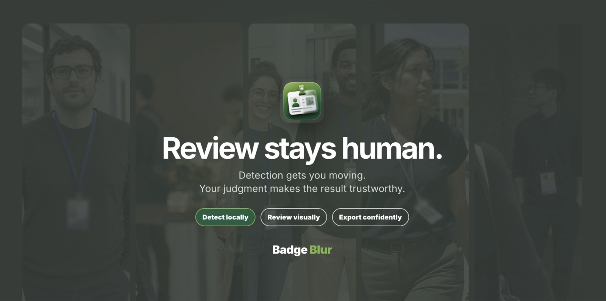

# Badge Blur

<p align="center">
  
</p>

A local-only Electron desktop application that detects likely identification
badges, lets a reviewer correct the masks, and saves redacted copies without
changing the original images.

## Video tutorial and Mac quick start

- [Watch the 1 minute 43 second tutorial video in your browser](https://www.dropbox.com/scl/fi/nlzfipl1kc16kqm6aln11/Badge-Blur-macOS-Tutorial.mp4?rlkey=9ehmhajx31dlwflaxflth6gb8&dl=0)
- [Download the selectable-text macOS installation flyer](output/pdf/Badge-Blur-macOS-Quick-Start.pdf)
- [Browse the editable HyperFrames tutorial source](videos/badge-blur-tutorial)
- [Download the complete source bundle and original 4K captures from the v0.22.1 Release](https://github.com/adammalin/Badge-Blur/releases/tag/v0.22.1)

<p align="center">
  <a href="https://www.dropbox.com/scl/fi/nlzfipl1kc16kqm6aln11/Badge-Blur-macOS-Tutorial.mp4?rlkey=9ehmhajx31dlwflaxflth6gb8&amp;dl=0">
    
  </a>
</p>

The finished video and multipart full-source archive are hosted as GitHub
Release assets so normal repository clones stay reasonably small. The editable
composition, narration, music, sound effects, processed footage, images, and
PDF generator remain in the repository.

## Start the app

From this folder:

```bash
npm run setup
npm start
```

`npm run setup` installs the JavaScript dependencies, downloads the pinned
local models, verifies their SHA-256 checksums, and builds the app. `npm start`
opens the Electron desktop window. Electron owns a private image-processing
service bound to a random `127.0.0.1` port and shuts it down with the app.

Do not use `npm run dev` for normal photo processing. The packaged local
Electron application is the supported path. `npm run start:web` remains
available only for browser-based development diagnostics.

## Model download

The current release uses the Apache-2.0 quantized ONNX conversion of
[`Grounding DINO Tiny`](https://huggingface.co/onnx-community/grounding-dino-tiny-ONNX).
Enhanced mode adds the quantized Transformers.js conversion of
[`CLIP ViT-B/32`](https://huggingface.co/Xenova/clip-vit-base-patch32) to
reject likely shirt details, signs, equipment labels, uniform patches, and
clipped objects. Both run locally and do not require Python, Ollama, or a
network connection after packaging.

Pinned model file:

```text
https://huggingface.co/onnx-community/grounding-dino-tiny-ONNX/resolve/ff690b0a8050566c290287545bd059350f3e9096/onnx/model_quantized.onnx?download=true
```

Expected destination:

```text
public/models/onnx-community/grounding-dino-tiny-ONNX/onnx/model_quantized.onnx
```

Expected SHA-256:

```text
70bf2d3310d1ae73769c96a71e00cbf2861eb33a1f4d97d84a108a7bf02c03c9
```

Pinned CLIP revision:
`d15189d7028b43f1d3e65039190477f6af591c2a`  
CLIP model SHA-256:
`0898a3facfdb27f0a041e57649b4989cfd094e4a0040d6ae75ed69917dfc7328`

The recommended route is:

```bash
npm run prepare:model
```

That script downloads both models plus their small configuration/tokenizer
files and refuses to continue if either checksum does not match. If direct
downloading is blocked, download the pinned file through an approved route,
copy it to the expected destination, then rerun `npm run prepare:model` to
verify it and obtain any missing small files.

## Workflow

1. Select a folder of JPEG, PNG, 8-bit single-page TIFF, WebP, AVIF, or
   HEIC/HEIF images.
2. Choose the output format for this batch: match each source, JPEG, PNG,
   TIFF, or WebP. The default destination remains a new unique run folder
   nested under the source folder's `exports` directory.
3. Wait for the bundled local models to load automatically.
4. Choose **Start batch**. Once the folder, output format, and local models are
   ready, a restrained green glow identifies it as the next action. During
   batch detection, a soft pulsing glow remains only at the window edges.
5. To stop claiming new images without losing progress, choose **Pause after
   active images**. Active images finish and save before the batch enters its
   paused state. Choose **Resume batch** to continue in the same run folder;
   already completed images are skipped.
6. Grounding DINO runs one period-delimited grounding prompt over each image.
7. With **Enhanced detection and filtering** enabled, the app detects people
   first and associates each retained badge with one person. For a person
   without a badge, it runs a targeted high-resolution torso pass, detects
   lanyards separately, and lowers the badge threshold only along the
   neck-to-waist/lanyard path. CLIP still rejects likely clothing details,
   signs, patches, and equipment labels. Close portraits, low-hanging cards,
   and edge-cropped credentials use a stricter classifier-confirmed fallback
   when the normal torso boundary would otherwise remove them.
8. The local corner fitter refines strong badge edges and keeps a rectangle
   when the fit is uncertain. A temporary local-contrast analysis pass helps
   recover faint plastic-holder edges; only its corner coordinates are used,
   and the original image contrast and exported pixels remain unchanged.
9. When processing finishes, the green completion screen pauses the workflow.
   Choose **Review photos** to begin with image 1 in the large viewer. Click or
   horizontally scroll the thumbnail filmstrip, use Previous/Next, or press the
   left/right arrow
   keys to move through the batch. Use **Fit in window** to see the complete
   frame or **Fill width** for a centered, width-filling inspection view. The
   Fill width and zoomed views expand the photo stage vertically so the whole
   review page scrolls instead of trapping the image in a short inner box.
   Use the `+`/`−` controls, Command/Control-scroll, or double-click to zoom;
   hold Space and drag to pan.
   The selected sizing mode is remembered across images and app launches. The
   filmstrip is joined to the batch workflow rail and labels each image as
   Waiting, Processing, Saving, Saved/review pending, Reviewed, or Needs
   attention. Navigation and edits to completed images remain available while
   other images process; only an image currently being detected is read-only.
   The next **Save, review & next** action receives the same subtle guidance.
10. Drag over a missed badge to add a mask.
11. Click a mask and drag its four corner handles to match badge perspective.
12. With a badge mask selected, adjust **Selected badge blur** when that one
    badge needs more or less redaction than the batch default. The override is
    stored on that reviewed mask in the run data.
13. Open **Advanced settings** only when you need to change detection,
    Gaussian blur strength, mask expansion, edge feather, or parallel
    processing.
14. Click a false mask and use **Remove** in the badge inspector or the Delete
    key. The inspector identifies **Badge N of N**, controls its saved blur
    override, and provides **Reset blur**.
15. Toggle **Before · edit masks** and **After · redacted** to compare the
    current mask with its redacted output. Badge Blur prepares the After view
    during automatic processing and saving, so unchanged images do not need a
    second redaction pass during review.
16. Choose **Save, review & next** after inspecting a photo. Badge Blur records
    the review, queues its latest output and run data for saving, then moves to
    the next unreviewed ready image. Use **Save only** when you want to persist
    an edit without marking the image reviewed or advancing.
17. **All images ready for review** is the normal neutral state. Use the
    flagged-issue queue only for processing failures or an implausibly large
    automatic mask. Visible people and lanyards do not imply that a badge
    should be present. Confirm every processed image before final export.

Keyboard review shortcuts are: left/right (or K/J) for navigation, N for the
next flagged issue, V for Before/After, M to focus mask editing, Delete to
remove the selected mask, R to save/review/advance, P to pause or resume a
batch, Command/Control with `+`, `−`, or scroll to zoom, and Space-drag to pan.

When processing finishes, Badge Blur opens the first flagged issue (or the
first image when there are no issues) and shows a green
processing-complete banner. Progressive redacted copies remain safely saved,
but **Export all/Re-export all** requires explicit review confirmation for
each processed image. The summary and run manifest record reviewed images,
unresolved warnings, masks added or removed, and corner adjustments. In the
Electron app, choose **Open export folder** to open the completed run in Finder
or File Explorer. Source-based exports open directly; a custom destination may
ask you to confirm the exact run folder once if Electron cannot recover its
native path. The Start/Pause/Export controls and live progress remain attached
to the bottom of the window while you scroll. Elapsed processing time is
right-aligned beside the finished, active, and worker counts below the
progress bar, then remains visible as the final total. The header's
half-circle control switches between light and dark themes.

The default redaction is a smooth Gaussian blur sized to 3% of the badge's
shorter edge. The Advanced settings panel can increase or decrease that
strength or switch to the optional pixelated mosaic style. Changing a
redaction setting refreshes and re-saves completed outputs in the active run.

Parallel processing defaults to **Auto**. The app uses logical-processor and
runtime memory signals plus a short local compute benchmark to select one or
two detector workers conservatively. Manual 1/2/4 choices are available for
controlled testing. Four workers remain manual because the measured local
benchmark showed no gain over two. Each worker owns a separate Grounding DINO
and CLIP session; each session uses a bounded thread count so
logical-processor capacity remains available for scrolling and review. Final
files and manifests are still written one at a time.

Each processed image is saved progressively into
`source-folder/exports/badge-remover-run-YYYYMMDD-HHMMSS-xxxxxxxx` by default.
**Choose different export folder** overrides that destination for the next
run. Every run folder contains redacted
copies, an adjacent `.metadata.mie` metadata archive for each copy, plus
`badge-removal-manifest.json` and
`badge-training-annotations.coco.json`. While a batch is running, it also
updates `badge-blur-checkpoint.json` after each serialized image export. The
checkpoint records completed, pending, active, and failed entries plus the
reviewed masks and settings needed to recover the queue. At most the images
that were actively processing at the instant of a crash need to be retried.
The timestamp and random run ID prevent a new export from reusing or
overwriting an older run folder. Source subfolders are preserved inside each
run so duplicate filenames from different folders do not collide.

Badge Blur also keeps one active-project cache in the local browser/Electron
profile. A refresh restores the source and export folder handles, queue state,
settings, current review position, and edited masks when Chromium retains
folder permission. If a browser does not retain its folder handle, Badge Blur
prompts for the same source folder once and then reapplies the cached review.
The cache stores project data locally and does not duplicate the source-image
bytes or upload them. The on-disk run checkpoint remains the durable recovery
record for crashes, app restarts, and moving a run to another computer.

Original images remain read-only and are deliberately not copied into the
output. Keeping the originals out avoids duplicating unredacted sensitive
pixels and reduces storage use. To revise a run, click **Import previous run**,
choose its `badge-removal-manifest.json`, and follow the source-folder prompt
if one appears. Badge Blur rejects unrelated JSON files and accepts only the
appropriate run manifest or checkpoint. It verifies every referenced source
image by relative path and file size before applying final reviewed masks and
settings. If the matching source folder was previously authorized and is still
available, Badge Blur restores it automatically. In Electron, it can also infer
the original source folder when the run file remains inside
`<source>/exports/<run>/`, verify every referenced image, and immediately
repopulate the filmstrip and Before/After reviewer. Otherwise, it asks for the
source folder named in the run file and refuses a different or changed image
set. It can also restore a run created by an earlier app version that contains
compatible reviewed masks.

To resume an interrupted batch in place, click **Import previous run**, choose
the run's `badge-blur-checkpoint.json`, choose that exact existing run folder,
then reselect the original source folder. Badge Blur verifies both the run ID
and each source file's size and last-modified timestamp. It restores completed
files without rewriting them, queues detected-but-unsaved masks for export,
and retries interrupted, pending, or failed detection entries. A normal
manifest import still creates a new run when revising a completed batch.

Closing the Electron window or pressing Command-Q/Alt-F4 during a batch offers
three choices: keep processing, quit immediately, or pause safely and quit.
The safe option finishes and saves active images, writes the checkpoint, then
stops the private local service. Closing while already paused writes the
paused checkpoint before shutdown.

The interface keeps **Batch processing time** and **Export processing time**
separate so a re-export does not erase detector timing. The run manifest
records both durations.

The COCO file records final reviewed quadrilaterals and COCO bounding boxes for
later local model training; it does not train or alter the bundled model during
use.

The **Match original** output option retains JPEG, PNG, TIFF, WebP, and AVIF
formats. The reviewer can instead choose JPEG, PNG, TIFF, or WebP for every
redacted copy in the run. HEIC/HEIF input uses TIFF with
`-redacted-from-heic` or `-redacted-from-heif` when matching the source because
portable HEIC encoding is not included. Writable EXIF, IPTC, XMP, copyright,
camera, and ICC-profile metadata is transferred. Orientation is normalized
after pixels are rotated. Embedded thumbnails and previews are intentionally
excluded because they could contain the original visible badge. The MIE
archive preserves the remaining source metadata for audit/recovery.

## Local-only controls

- Model loading from remote services is disabled in application code.
- The model, tokenizer, and ONNX runtime files are bundled locally.
- Content Security Policy allows network reads only from the local app origin
  and local in-memory `blob:` image URLs.
- Electron independently cancels every renderer HTTP, HTTPS, and WebSocket
  request whose destination is not loopback, including private-LAN addresses.
- The server binds to `127.0.0.1`, not the LAN.
- There are no analytics, telemetry, accounts, or cloud APIs.
- `npm run test:security` verifies the loopback binding, offline model policy,
  browser connection policy, and Electron's non-local request denial.
- The bundled Electron Chromium runtime provides the folder-write API and
  native folder chooser consistently on both supported operating systems.
  Files are written sequentially into the source folder's `exports` subfolder
  unless the reviewer chooses another destination.
- A local IndexedDB project cache protects the active review from page refresh.
  It contains paths, settings, queue state, and masks—not duplicate source
  images—and never leaves the computer.
- Detection uses the selected bounded worker pool while redaction/export and
  audit-manifest writes remain sequential. Detection can overlap the previous
  image's local export. Up to five bounded 1200-pixel review previews are
  retained around the active image, while the filmstrip uses separate lazy
  240×156 thumbnails. Full-resolution sources are opened only for active
  processing stages.

The one-time setup step does contact npm and Hugging Face to download public
software/model files. Image processing after setup is local.

## Installers and portable packages

The latest review, re-export, preview-refresh, and detection improvements are
available in the `v0.22.1` GitHub release. That
release includes the Apple-silicon Mac ZIP and DMG, a Windows x64 installer,
and SHA-256 checksums. The source instructions remain available for testers
whose managed computers cannot install unsigned applications.

### Install and test on macOS

The current Mac package supports Apple-silicon Macs running macOS 13 or later.
Download `Badge-Blur-Mac-arm64-v0.22.1.dmg` from the
[v0.22.1 release](https://github.com/adammalin/Badge-Blur/releases/tag/v0.22.1).
The matching ZIP also works, but the DMG is the preferred test package.

1. Download the Mac artifact and unzip the GitHub artifact if necessary.
2. Optional but recommended: place the DMG and its `.sha256` file together,
   open Terminal in that folder, and run:

   ```bash
   shasum -a 256 -c Badge-Blur-Mac-arm64-v*.dmg.sha256
   ```

3. Open the DMG and drag **Badge Blur.app** onto the **Applications**
   shortcut.
4. Open `/Applications/Badge Blur.app` once. Because this test build is not
   Developer ID signed or notarized, macOS may block it. Dismiss the warning
   without moving the app to the Trash.
5. Open **System Settings > Privacy & Security**, scroll to **Security**, and
   click **Open Anyway** for Badge Blur. Apple makes this option available for
   about one hour after the blocked launch.
6. Authenticate when prompted. When macOS shows the warning again, click
   **Open**.
7. Badge Blur should open as a normal desktop window with its own bundled
   Chromium runtime. No external browser, Terminal window, account, Ollama
   installation, or internet connection is required after installation.
8. Download and unzip the synthetic demo set described below. Select its
   `demo-test-images` folder, run a batch, review every mask, and confirm that
   redacted copies and the run manifest are written to a new uniquely named
   export folder. Confirm that the source images are unchanged.
9. Click **Quit Badge Blur** in the upper-right corner, press Command-Q, or
   close the application window. Confirm that Badge Blur closes and its private
   local service no longer remains running.

After the first approved launch, macOS saves Badge Blur as an exception and it
normally opens by double-clicking. Do not disable Gatekeeper globally or use
commands that recursively remove quarantine attributes. On a managed Mac, the
**Open Anyway** option may be unavailable; use the organization's approved
software-distribution or support process instead.

To uninstall, quit Badge Blur and move `/Applications/Badge Blur.app` to the
Trash. The app installs no system extensions or background agents. Export
folders created by the tester are user data and are intentionally preserved.

Apple's current instructions are available in
[Open a Mac app from an unknown developer](https://support.apple.com/guide/mac-help/open-a-mac-app-from-an-unknown-developer-mh40616/mac).

### Run from source on a Mac without installing the unsigned app

For a technically comfortable tester who cannot approve the unsigned
`Badge Blur.app`, the supported alternative is to run the same Electron
application from source. This does not install anything in `/Applications` and
does not disable or alter Gatekeeper.

Requirements:

- An Apple-silicon Mac running macOS 13 or later.
- Internet access during first setup to download the pinned public npm
  packages, official Node.js runtime when needed, and local model files.

The installer and first-time setup therefore use the internet. Normal image
review and export do not: after setup, model inference and image processing use
only bundled files and the loopback service. Clicking the GitHub or email links
in the footer deliberately hands that link to the user's default browser or
mail application; Badge Blur does not attach image or project data.

The setup uses an existing Node.js 22 installation when available. If Node is
missing or incompatible, it downloads the pinned official Node.js 22 runtime
for the Mac's architecture, verifies it against Node's published SHA-256 list,
and keeps it privately inside `.runtime/` in the Badge Blur folder. It does not
request administrator access or install Node system-wide.

#### Two-command source setup

Open Terminal, then use these same two commands for the first install and every
future update:

```bash
/usr/bin/curl --fail --location --show-error \
  https://raw.githubusercontent.com/adammalin/Badge-Blur/main/scripts/bootstrap-mac-source-test.zsh \
  --output "$HOME/Downloads/badge-blur-install.zsh"

/bin/zsh "$HOME/Downloads/badge-blur-install.zsh" \
  "$HOME/Badge-Blur-source-test"
```

The first command only downloads the readable bootstrap script. The second
command downloads the latest main-branch repo ZIP and runs the local setup. If
`~/Badge-Blur-source-test` does not exist, it creates it. If that folder is an
existing Badge Blur source-test installation, the same command updates its
application source in place, reconciles dependencies, verifies the pinned
local models, rebuilds, and launches the current version. Downloaded models,
exports, and repository metadata are preserved. An unrelated folder is never
overwritten. macOS includes `curl`, `unzip`, and `rsync`, so `wget` is not
required. If the bootstrap is run from inside an existing non-repository Badge
Blur source-test folder, it updates that folder directly instead of creating a
nested `Badge-Blur-source-test/Badge-Blur-source-test` copy.

To use a different destination, supply it to the second command:

```bash
/bin/zsh "$HOME/Downloads/badge-blur-install.zsh" \
  /path/to/Badge-Blur-source-test
```

Run the same two commands again whenever a newer version is available. Quit
the currently running Badge Blur window first; the existing source-test folder
will be safely updated rather than rejected.

For later launches:

```bash
cd "$HOME/Badge-Blur-source-test"
/bin/zsh scripts/start-mac-source-test.zsh
```

#### Manual source ZIP setup

1. Download the
   [main branch source ZIP](https://github.com/adammalin/Badge-Blur/archive/refs/heads/main.zip)
   and expand it.
2. Open Terminal and change to the expanded folder. For example:

   ```bash
   cd ~/Downloads/Badge-Blur-main
   ```

3. Run the checked-in setup script explicitly with zsh:

   ```bash
   zsh scripts/setup-mac-source-test.zsh
   ```

The script verifies Node.js, installs the exact versions in
`package-lock.json`, downloads and verifies the pinned models, builds the
interface, and opens Badge Blur in Electron. It does not use `sudo`, copy an
app into `/Applications`, call `xattr`, or change `spctl` settings. Close the
window or press Command-Q to stop the app and its private local service.

After the first setup, launch it again from the same source folder with:

```bash
zsh scripts/start-mac-source-test.zsh
```

To remove this source-run copy, quit Badge Blur and delete the expanded source
folder. This also removes its private Node runtime and npm dependencies.
Export folders are separate user data and are not deleted.

This route is intended for development testing, not broad deployment. A
Developer ID-signed and notarized build, or an organization-managed deployment,
is still the correct way to provide a warning-free installed Mac application.

### Synthetic demo test images

The five fictional test photographs are tracked in
[`demo-test-images/`](demo-test-images/). They contain 11 expected badge
regions across single-person, event, group, outdoor-glare, and low-light
scenarios. The people, organizations, badge designs, portraits, text-like
marks, and code-like graphics are fictional; the set contains no ORNL, DOE, or
valid employee badge information.

- [Browse the individual test images](demo-test-images/)
- [Download all five test images as a ZIP](downloads/Badge-Blur-Demo-Test-Images.zip?raw=1)
- [Download the ZIP SHA-256 checksum](downloads/Badge-Blur-Demo-Test-Images.zip.sha256?raw=1)
- [Read the expected badge counts and limitations](demo-test-images/README.md)

The archive also includes the test-set README and original generation prompts.
To rebuild it after an approved change to the canonical fixtures, run:

```bash
npm run package:demo-images
```

Synthetic images are appropriate for demonstrations and pipeline smoke tests,
but they do not establish production accuracy. Continue to use human review
and an approved, locally stored validation set for production qualification.

### Build packages from source

Electron installers must be built on their matching operating system. Build
the Apple-silicon Mac DMG and ZIP on macOS:

```bash
npm run package:mac
```

Build the per-user x64 Windows installer on Windows:

```bash
npm run package:windows
```

Both commands write versioned artifacts and SHA-256 checksums to `releases/`.
The Mac package is a conventional drag-to-Applications DMG plus ZIP. The
Squirrel.Windows setup installs per user without requiring an administrator,
creates a Start Menu application, and registers a normal uninstaller under
**Settings > Apps > Installed apps**. Both contain Electron, the production
interface, image runtime, local models, and system icon.

The GitHub Actions workflow independently builds the Mac ARM64 DMG/ZIP and
Windows x64 setup executable on their matching hosted operating systems.

Installer CI is intentionally not run for ordinary branch pushes. It runs only
when started manually from the **Build installable apps** workflow or when a
version tag matching `v*` is pushed.

Each launch receives a new shutdown token. The Electron main process owns the
private service, and closing the window or quitting the app shuts down that
service and releases its random port. The service also watches its Electron
parent and exits if the application crashes. A second launch focuses the
existing Badge Blur window instead of starting a duplicate process.

Recipients do not need a separate browser, Ollama, Python, Node.js, npm, or an
internet connection.
The Mac app has an ad-hoc integrity signature, but it is not Developer ID
signed or Apple notarized. After the first blocked launch, testers can use
**System Settings > Privacy & Security > Open Anyway** on an unmanaged Mac.
The unsigned Windows installer can similarly trigger SmartScreen. Installer
format and system icons do not bypass either security system. Managed computers
may require normal organizational approval or software distribution.

Release infrastructure supports organization-controlled signing credentials
without storing them in the repository:

- Set `MACOS_SIGNING_ENABLED=1` after installing a Developer ID Application
  certificate in the build keychain. Notarization accepts either
  `APPLE_API_KEY`, `APPLE_API_KEY_ID`, and `APPLE_API_ISSUER`, or `APPLE_ID`,
  `APPLE_APP_SPECIFIC_PASSWORD`, and `APPLE_TEAM_ID`.
- Set `WINDOWS_CERTIFICATE_FILE` and `WINDOWS_CERTIFICATE_PASSWORD` to sign the
  Squirrel.Windows installer with an Authenticode PFX certificate.

Without those credentials, packaging deliberately retains the documented
ad-hoc Mac signature and unsigned Windows fallback for controlled testing.

The rounded interface corners and icon-derived green/sage/silver palette in
0.22.0 are a product-direction exception to the stricter square-corner ORNL
brand default. Treat the interface as a draft pending the appropriate brand
review for an official lab-wide release.

## MVP limitations

- Human review is required.
- The torso-guided enhanced path on the reviewed 18-image local regression
  currently measures 75.6% automatic badge recall and 89.5% mask precision.
  It is useful as a first-pass reviewer,
  not as an unattended compliance control. White/translucent cards and distant
  small badges remain the main miss cases.
- Automatic detections begin with an angle-aware four-corner edge fit.
  Reviewers can move all four corners independently to conform the redaction
  to a tilted badge. Uncertain, weak, self-intersecting, or unsafe geometry
  falls back to the original detection rectangle.
- The corner fitter does not use a second cloud or generative model. It scores
  continuous local edges inside the Grounding DINO detection and verifies that the
  expanded fitted mask still covers the original detection. Opposite edges are
  checked together so strong internal card graphics or shirt folds cannot define
  incompatible corners, including on rotated horizontal badges.
- Feathering softens the transition at the expanded mask boundary. Keep enough
  mask expansion to cover all sensitive badge pixels. When a mask reaches the
  physical image boundary, its blur remains fully applied through the final row
  or column instead of feathering back toward the unredacted source.
- A lighter Gaussian setting can preserve too much text on unusually large or
  high-contrast credentials. Always review the After view at useful zoom.
- The bundled model is fixed during inference. Reviewed corrections are saved
  as local annotations but do not update the model automatically.
- The frozen five-image synthetic Electron test found all 11 visible badge
  regions with 11 complete boxes and no false boxes. This small synthetic
  result does not predict accuracy on cleared production photographs.
- The queued design avoids loading every full-resolution image at once, but a
  representative hundreds/thousands-image soak test is still required before
  production use.
- Enhanced mode is substantially slower because it verifies ambiguous global
  candidates, runs a person pass, one badge pass per torso, and a classifier
  on rescue candidates. Turn it off for the faster v0.9-style full-image pass.
- More detector workers are not guaranteed to scale linearly because each
  ONNX session competes for CPU and memory bandwidth. On the development
  workstation, two model workers were 1.02× faster than one on the four-image
  detector benchmark, while four were slightly slower; pipeline overlap can
  provide additional batch benefit.
- Four-worker mode is intentionally marked as high-memory and should be
  qualified on the actual Windows or Mac workstation before large batches.
- RAW files, multi-page images, and images above 8 bits per channel are
  rejected instead of being silently developed, flattened, or reduced.
- HEIC/HEIF output is TIFF, not HEIC/HEIF.
- Pixel edits necessarily re-encode the image; this is metadata-preserving,
  not byte-for-byte image preservation.
- No Lightroom catalog or Photoshop integration yet.
- Synthetic images are useful for pipeline testing but do not establish
  production accuracy.

See [TEST-REPORT.md](TEST-REPORT.md) for the frozen demo result.

## Local real-photo regression

Place approved local test images in
`test-data/local-badge-evaluation/`. That directory and generated
`test-output/` artifacts are git-ignored so sensitive pixels are not packaged.
The reviewed normalized badge centers live in
`test-data/badge-ground-truth.json`.

Run the same enhanced local path used by the app:

```bash
npm run test:badge-production
```

Each run creates a unique folder under `test-output/` containing a JSON report,
per-image overlays, and a contact sheet. Green circles are covered reference
points; red circles are missed reference points.
